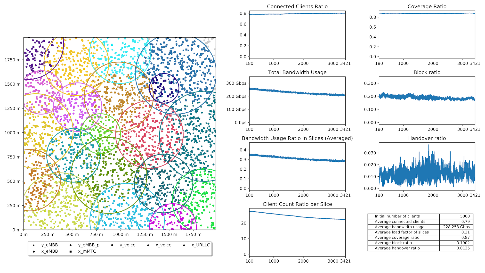

# 📡 Simulasi Network Slicing Jaringan 5G 

Selamat datang di proyek **Simulasi Network Slicing 5G**! Proyek ini saya kembangkan untuk mengeksplorasi bagaimana teknologi *network slicing* pada jaringan 5G dapat digunakan untuk mengalokasikan sumber daya secara efisien dalam satu infrastruktur fisik yang sama.

Dengan pendekatan modular berbasis Python, proyek ini menyimulasikan bagaimana *base station*, *client*, dan *slice* berinteraksi untuk memenuhi kebutuhan berbagai skenario komunikasi di era 5G.

---

## 📚 Deskripsi Singkat

Dalam jaringan 5G, **network slicing** memungkinkan satu infrastruktur fisik dibagi menjadi beberapa jaringan logis dengan karakteristik yang berbeda-beda. Proyek ini bertujuan untuk:

* 📶 Mensimulasikan *base station* dan area jangkauan 5G
* 🔁 Membangun *slice* dengan profil berbeda (eMBB, URLLC, mMTC)
* ⚖️ Mengatur alokasi dinamis bandwidth, frekuensi, dan komputasi
* 📊 Menganalisis performa dari sisi latency, throughput, dan efisiensi

---

## 🔍 Fitur Utama

* 🧩 **Arsitektur Modular** – Dibangun dengan Python, mudah dikembangkan dan dipelajari
* 📡 **Simulasi BTS 5G** – Meniru interaksi antara *base station* dan client
* 🔧 **Alokasi Sumber Daya Dinamis** – Bandwidth, computing, dan coverage disesuaikan
* 📈 **Analisis Performa Real-Time** – Visualisasi metrik langsung dari setiap *slice*

---
## 📸 Cuplikan Simulasi

Beberapa hasil visualisasi dari simulasi network slicing:

<p align="center">  </p>

<p align="center">  </p>

---

## 🚀 Cara Menjalankan Proyek

### Prasyarat

* Python 3.8 atau lebih tinggi
* Install dependensi dengan:

```bash
pip install -r requirements.txt
```

### Instalasi

```bash
git clone https://github.com/your-username/5g-network-slicing-simulation.git
cd 5g-network-slicing-simulation
python __main__.py
```

---

## 🗂 Struktur Proyek

| File             | Fungsi                                       |
| ---------------- | -------------------------------------------- |
| `BaseStation.py` | Simulasi BTS dan manajemen client            |
| `Client.py`      | Simulasi perilaku user dalam mengakses slice |
| `Slice.py`       | Implementasi logika *network slice*          |
| `Distributor.py` | Alokasi bandwidth & resource                 |
| `Coverage.py`    | Simulasi area sinyal 5G                      |
| `Stats.py`       | Pengumpulan & analisis metrik performa       |
| `Graph.py`       | Visualisasi metrik jaringan                  |
| `utils.py`       | Fungsi bantu                                 |

---

## 🌐 Apa Itu Network Slicing?

Saya mensimulasikan 3 tipe slice utama yang digunakan dalam jaringan 5G:

* **eMBB**: Internet berkecepatan tinggi (cocok untuk AR/VR)
* **mMTC**: IoT berskala besar dengan daya rendah
* **URLLC**: Komunikasi kritikal seperti kendaraan otonom & operasi jarak jauh

---

## 📊 Metrik yang Dianalisis

* ⚡ **Latency**: Delay transmisi antar node
* 📶 **Throughput**: Kecepatan data per slice
* ⚙️ **Resource Utilization**: Efisiensi alokasi bandwidth & CPU

---

## 🔮 Rencana Pengembangan

* 💡 **AI untuk Alokasi Resource**
* 🌐 **Integrasi dengan Edge Computing (MEC)**
* 📈 **Skalabilitas untuk Simulasi Skala Nasional**

---

## 🤝 Kontribusi

Proyek ini terbuka untuk kolaborasi! Jika kamu tertarik memperluas fitur atau mengoptimalkan performa simulasi, silakan *fork*, buat perubahan, dan kirimkan *pull request*.

### Langkah Kontribusi

1. Fork repo ini
2. Buat branch fitur baru
3. Commit dan push
4. Buka pull request di GitHub

---
